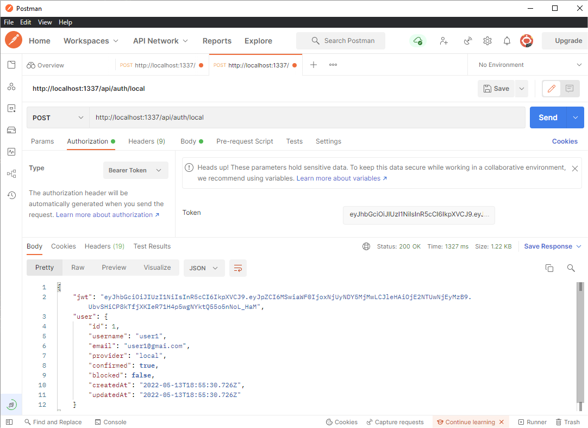

# 🚀 Strapi v4 owner (authored) content example with global policy and middleware


### Authored content

I made this example to show a policy/middleware/controller to manage ownership of content.

- The middleware assign author to each content automatically
- The policy check if content is acceded by his owner (author)
- The policy and middleware are global to allow be used in more than one content type (DRY concept)
- The controller only lists the own content (method find) applying a filter
- In route file is set the configuration of each method actions

### Clue files

- Policy: ****
- Middleware: ****
- Controller: ****
- Route Config: ****


### But don't forget to configure...
- the content type adding a field relation named *author*
- configure properly role settings (steps 12 & 13) for authenticated users

### Notes & Tasks

I created two content types: Notes and Task. Intended to be private to each user. 

Both types use global policy and middleware and have custom controller to method find.

### How was the setup

**1st step**: installation of strapi:
```
yarn create strapi-app strapi4author --quickstart
```

_Note: we use quickstart only for this example_


**2nd**: changing to project dir
```
cd strapi4author
```


**3th**: run in develop mode
```
yarn develop
```


**4th**: we put http://localhost:1337/admin in or browser and create super admin user


**5th**: we go to content type builder and create a new content-type collection named 'notes' ('note' in singular) with these fields:

- text: with the note content
- author: is a relation 1-Many to table user-permissions


**6th**: generate policy
```
yarn strapi generate
$ strapi generate
? Strapi Generators *policy* - Generate a policy for an API*
? Policy name *is-owner*
? Where do you want to add this policy? *Add policy to root of project*
√  ++ \policies\is-owner.js
Done in 48.02s.
```

It creates a policy file called ./src/policies/is-owner.js


**7th**: we edit the file is-owner.js

See 


**8th**: we generate middleware assign-owner.js

```
yarn strapi generate
$ strapi generate
? Strapi Generators *middleware* - Generate a middleware for an API
? Middleware name *assign-owner*
? Where do you want to add this middleware? *Add middleware to root of project*
√  ++ \middlewares\assign-owner.js
Done in 88.63s.
```

:Note: take care of step 13 to run this middleware properly


**9th**: we edit assign-owner.js

See 


**10th**: we edit ./src/api/note/routes/note.js and assign middleware and policies

See 


*11th:* to allow users only view their own notes (and no other users notes) you must customize controller. 

So you edit ./src/api/note/controllers/note.js

See 


**12th**: you must configure permissions in settings -> roles to only authenticated users to access notes actions


**13th**: you *MUST* give permission to user-permissions plugin to be able fill author relation in assign-owner middleware


**14th**: you can create some user and log in (here I used postman)

Logging in


Copy the token to auth bearer field


Once logged in you can create the first note


You can check that author automatically assigned:


**15th**: if you try to update owned content will succeed, but if we change owner you will get forbidden error (403)

Updating note #31:


Changing author of that content manually in backend:


Now trying to update is forbidden


**16th**: optionally you can create another content-type (e.g. tasks) to reuse global policy and middleware created


